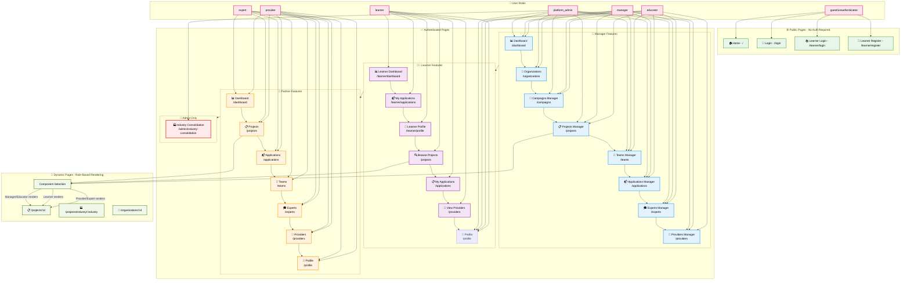

```mermaid
graph TD
    subgraph Roles["🔐 User Roles"]
        PA["platform_admin"]
        MG["manager"]
        ED["educator"]
        EX["expert"]
        PR["provider"]
        LR["learner"]
        GU["guest/unauthenticated"]
    end

    subgraph Public["🌐 Public Pages - No Auth Required"]
        HOME["🏠 Home - /"]
        LOGIN["🔑 Login - /login"]
        LLEARN["📚 Learner Login - /learner/login"]
        LREG["📝 Learner Register - /learner/register"]
    end

    subgraph Auth["✅ Authenticated Pages"]
        direction LR
        
        subgraph Manager["👔 Manager Features"]
            direction TB
            DASH["📊 Dashboard<br/>/dashboard"]
            ORG["🏢 Organizations<br/>/organizations"]
            CAMP_M["📢 Campaigns Manager<br/>/campaigns"]
            PROJ_M["📋 Projects Manager<br/>/projects"]
            TEAM["👥 Teams Manager<br/>/teams"]
            APP_M["📬 Applications Manager<br/>/applications"]
            EXP_M["🎓 Experts Manager<br/>/experts"]
            PROV_M["🤝 Providers Manager<br/>/providers"]
            DASH --> ORG --> CAMP_M --> PROJ_M --> TEAM --> APP_M --> EXP_M --> PROV_M
        end

        subgraph Learner["👨‍🎓 Learner Features"]
            direction TB
            LDASH["📊 Learner Dashboard<br/>/learner/dashboard"]
            LAPP["📬 My Applications<br/>/learner/applications"]
            LPROF2["👤 Learner Profile<br/>/learner/profile"]
            PROJ_L["🔍 Browse Projects<br/>/projects"]
            APP_L["📋 My Applications<br/>/applications"]
            PROV_L["🤝 View Providers<br/>/providers"]
            LPROF["👤 Profile<br/>/profile"]
            LDASH --> LAPP --> LPROF2 --> PROJ_L --> APP_L --> PROV_L --> LPROF
        end

        subgraph Partner["🤝 Partner Features"]
            direction TB
            DASH_P["📊 Dashboard<br/>/dashboard"]
            PROJ_P["📋 Projects<br/>/projects"]
            APP_P["📬 Applications<br/>/applications"]
            TEAM_P["👥 Teams<br/>/teams"]
            EXP_P["🎓 Experts<br/>/experts"]
            PROV_P["🤝 Providers<br/>/providers"]
            PROF_P["👤 Profile<br/>/profile"]
            DASH_P --> PROJ_P --> APP_P --> TEAM_P --> EXP_P --> PROV_P --> PROF_P
        end

        subgraph Admin["🔴 Admin Only"]
            direction TB
            CONS["🏭 Industry Consolidation<br/>/admin/industry-consolidation"]
        end
        
        Manager --> Learner
        Learner --> Partner
        Partner --> Admin
    end

    subgraph Details["📄 Dynamic Pages - Role-Based Rendering"]
        PROJ_DETAIL["📋 /projects/:id"]
        PROJ_IND["🏭 /projects/industry/:industry"]
        ORG_DETAIL["🏢 /organizations/:id"]
        COMP["Component Selection"]
    end

    %% Public Access
    GU --> HOME
    GU --> LOGIN
    GU --> LLEARN
    GU --> LREG

    %% Platform Admin - Full Access
    PA --> DASH
    PA --> ORG
    PA --> CAMP_M
    PA --> PROJ_M
    PA --> TEAM
    PA --> APP_M
    PA --> EXP_M
    PA --> PROV_M
    PA --> LPROF
    PA --> CONS

    %% Manager - Organization Level
    MG --> DASH
    MG --> ORG
    MG --> CAMP_M
    MG --> PROJ_M
    MG --> TEAM
    MG --> APP_M
    MG --> EXP_M
    MG --> PROV_M
    MG --> LPROF

    %% Educator
    ED --> DASH
    ED --> CAMP_M
    ED --> PROJ_M
    ED --> TEAM
    ED --> APP_M
    ED --> EXP_M
    ED --> PROV_M
    ED --> LPROF

    %% Expert
    EX --> DASH_P
    EX --> PROJ_P
    EX --> APP_P
    EX --> TEAM_P
    EX --> EXP_P
    EX --> PROV_P
    EX --> PROF_P

    %% Provider
    PR --> DASH_P
    PR --> PROJ_P
    PR --> APP_P
    PR --> TEAM_P
    PR --> EXP_P
    PR --> PROV_P
    PR --> PROF_P

    %% Learner - Limited Access
    LR --> LDASH
    LR --> LAPP
    LR --> LPROF2
    LR --> PROJ_L
    LR --> APP_L
    LR --> PROV_L
    LR --> LPROF

    %% Dynamic Pages
    PROJ_M --> COMP
    PROJ_L --> COMP
    PROJ_P --> COMP
    COMP -->|Manager/Educator renders| PROJ_DETAIL
    COMP -->|Learner renders| PROJ_DETAIL
    COMP -->|Provider/Expert renders| PROJ_DETAIL

    %% Styling
    classDef publicAccess fill:#e8f5e9,stroke:#4caf50,stroke-width:2px,color:#000
    classDef managerFeature fill:#e3f2fd,stroke:#2196f3,stroke-width:2px,color:#000
    classDef learnerFeature fill:#f3e5f5,stroke:#9c27b0,stroke-width:2px,color:#000
    classDef partnerFeature fill:#fff3e0,stroke:#ff9800,stroke-width:2px,color:#000
    classDef adminFeature fill:#ffebee,stroke:#f44336,stroke-width:3px,color:#000
    classDef role fill:#fce4ec,stroke:#e91e63,stroke-width:2px,color:#000
    classDef dynamic fill:#f1f8e9,stroke:#558b2f,stroke-width:2px,color:#000

    class HOME,LOGIN,LLEARN,LREG publicAccess
    class DASH,ORG,CAMP_M,PROJ_M,TEAM,APP_M,EXP_M,PROV_M managerFeature
    class LDASH,LAPP,LPROF2,PROJ_L,APP_L,PROV_L learnerFeature
    class DASH_P,PROJ_P,APP_P,TEAM_P,EXP_P,PROV_P,PROF_P partnerFeature
    class CONS adminFeature
    class PA,MG,ED,EX,PR,LR,GU role
    class PROJ_DETAIL,PROJ_IND,ORG_DETAIL,COMP dynamic
```